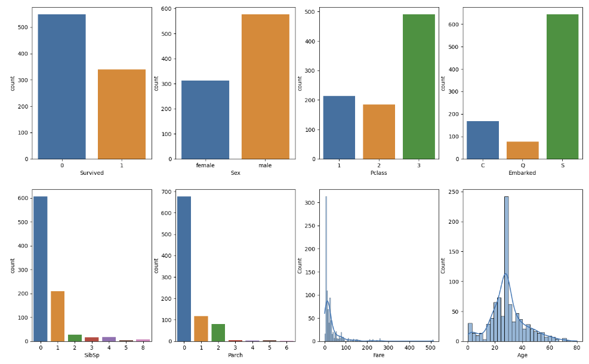
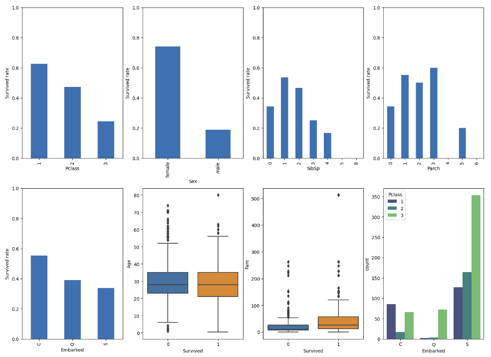

# Titanic Survival Factors: An Exploratory Data Analysis
This project focuses on performing Exploratory Data Analysis (EDA) on the Titanic dataset to uncover the key factors influencing passenger survival. The analysis aims to answer the following questions:
* Did passengers in higher classes (Pclass) have a better survival rate compared to those in lower classes?
* Was there any evocation policy implemented during the crisis?
* Did passengers with more family members aboard (based on SibSp and Parch) have different survival rates compared to those traveling alone?
* Was there a difference in survival rates based on the port of embarkation (Embarked)?
* How does the survival rate vary across different age groups? For instance, did children (under a certain age) have a higher survival rate compared to adults?
* Is there a relationship between the ticket fare and the survival rate within each class?
* Does having a known cabin number (i.e., not missing) correlate with a higher survival rate?
## Dataset
The Titanic dataset provides details about passengers on board, including their age, gender, class, fare, cabin, survival status, etc. It was sourced from [Kaggle](https://www.kaggle.com/datasets/yasserh/titanic-dataset).
## Requirements
* python >= 3.0
* Pandas
* Matplotlib
* Seaborn
## Data Cleaning
Cleaning steps:
* Handling missing values.
* Dropping duplicate rows.
* Duplicate columns check.
* Data Format check
* Outlier check
* Changing Datatype
## Exploratory Data Analysis
* Univariate analysis.
* Bivariate Analysis.
*  Correlation Analysis
## Key Visualizations
A few of the visualization highlights are:

## Findings & Insights
* Survival Rate: The overall survival rate was approximately 38%.
* Gender: Females had a much higher survival rate compared to males.
* Class: Passengers in first class had a significantly higher survival rate.
* Age: Younger passengers, particularly children, had higher survival rates.

  
